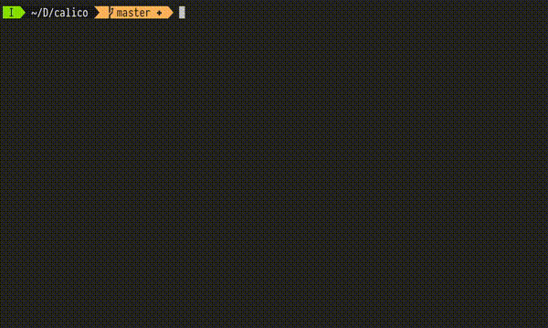

# Calico :cat2:
Calico is a small utility written in Haskell which is `cat` but for colors.

It accepts input in the form of delimited hex colors or the GPL palette format.

Its output is highly configurable, and it is able to convert between RGB and HSL.

It also features a primitive command language for modifying the hue, saturation and luminosity values of all colors in the palette.

# Demonstration

# Bash, Fish and Zsh completion
Thanks to `optparse-applicative`, calico can automatically generate completion scripts for various shells.
Instructions can be found [here](https://github.com/pcapriotti/optparse-applicative#bash-zsh-and-fish-completions) and require minimal effort on the user's part.

# Motivations

`calico` was born out of a frustration with having to open a full image editor
in order to view the colors contained within a palette. It makes use of true-color terminal
escape codes to display the colors with accuracy on the command line.

# Further features
Feel free to request changes or features under the issues manager.
